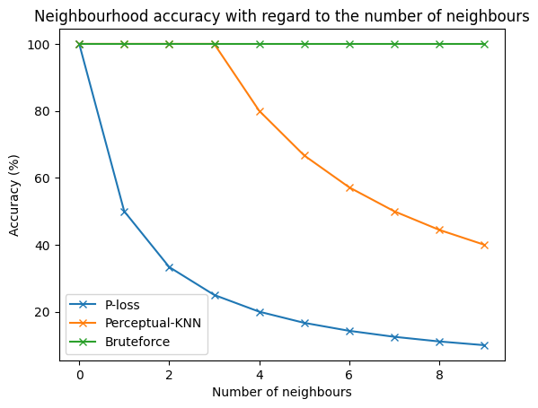

# perceptual-kNN

## Dependencies

Standard packages :
  -  Pytorch
  -  Numpy
  -  Pandas
  -  Matplotlib

Specific packages :
  - jtfs-gpu (differentiable Kymatio JTFS) : https://github.com/cyrusasfa/jtfs-gpu (install instructions available in the repository)

## Pre-computing the (phi o g)(theta) 

To precompute the values needed for the KNN, simply run the precompute_S.py script.

Inside you can change the number of process and the batch size to fit your GPU and VRAM.

With the full parameters dataset (subdiv = 10) the precomputations dataset will be a bit more than 50go.

## Running the KNN tests 

The code to run is in the KNN notebook, the Bruteforce method requires the precomputed values, the other 2 methods do not.

## Checking the results 

The Method characterization section of the KNN notebook contains a few different test to check the accuracy of the different methods.

For example, with the full parameter dataset : 

## Misc

- FTM Synth tests in examples folder
