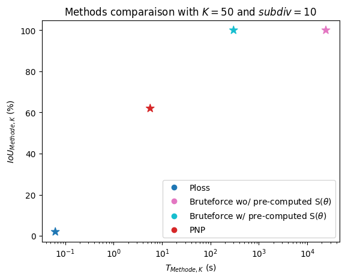

# perceptual-kNN

Finding the perceptual neighbours of sound generated from a drum syntheziser, using different methods to approximate the distance in the perceptual domain

## Dependencies

The only non-standard python package is jtfs-gpu (differentiable Kymatio JTFS) : https://github.com/cyrusasfa/jtfs-gpu (install instructions available in the repository)

## Pre-computing the (phi o g)(theta) 

To precompute the values needed for the KNN, simply run the precompute_S.py script.

Inside you can change the number of process and the batch size to fit your GPU and VRAM.

With the full parameters dataset (subdiv = 10) the precomputations dataset will be a bit more than 50go.

## Running the KNN tests 

The code to run is in the KNN notebook, the Bruteforce method requires the precomputed values, the other 2 methods do not.

## Checking the results 

The Method characterization section of the KNN notebook contains a few different test to check the accuracy of the different methods.

For example, the methods comparaison : 

