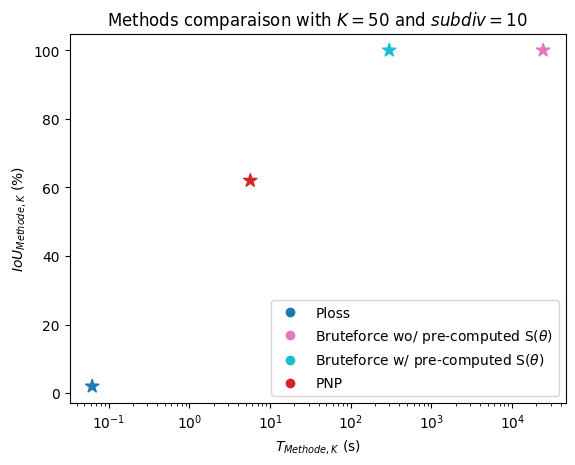

# perceptual-kNN

Finding the perceptual neighbours of sound generated from a drum syntheziser, using different methods to approximate the distance in the perceptual domain

## Dependencies

We use uv to hanlde dependencies. For a manual setup the only non-pip package is the fork of kymatio found here : https://github.com/Leon-Albert/jtfs-gpu

## Pre-computing the (phi o g)(theta) 

To precompute the values needed for the KNN, simply run the precompute_S.py script. Inside you can change the number of process and the batch size to fit your GPU and VRAM.

## Running the experiment

All the code to run is in the main notebook

## Checking the results 

In the notebook you'll find a few different test to check the accuracy of the different methods, wether for the KNN or the KNN-graph.

For example, the methods comparaison : 

## Audio examples

Some audio examples can be heard here : https://leon-albert.github.io/perceptual-kNN/ 
